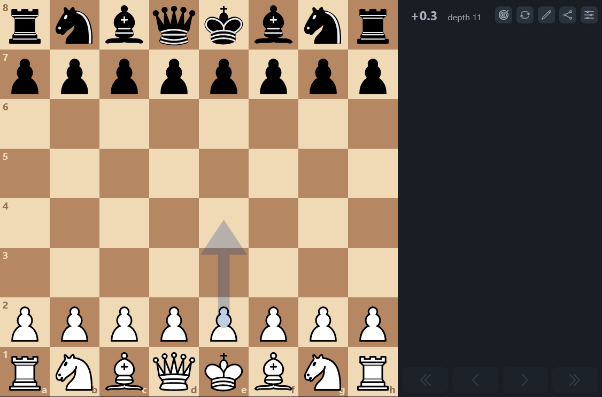

# Chess-App

A chess web application for playing against my personal chess engine.

Plat at: [yousafe.github.io/chess-app/](https://yousafe.github.io/chess-app/)

## Features

- Standard Game Logic
- Scrub Game History
- Import PGN
- Share Game
- Play against computer (My Engine & Stockfish)
- Progressive Web Application

## License

This project is licensed under GPLv3.